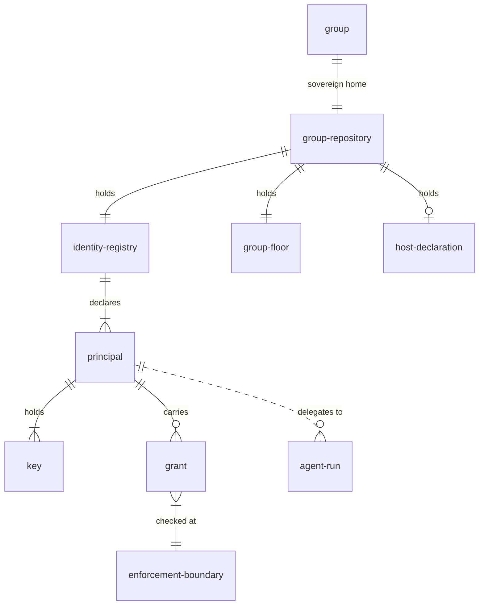
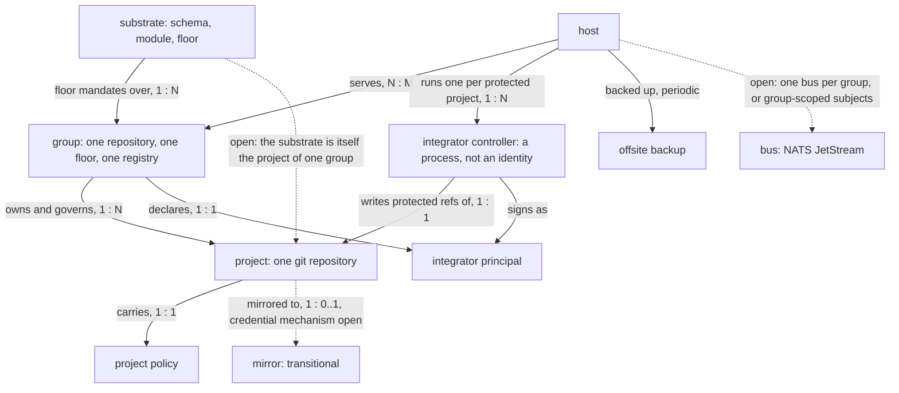
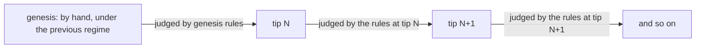

# Architecture

The bets, each traced to a requirement ([requirements.md](./requirements.md)) and taken no deeper
than rationale. Detailed design lives in the rest of `design/`, and only for roadmap phases that are
current or next — later phases get their detail re-fleshed when they start, informed by what
validation has taught us.

## Shape of the system

```
  bare git (Tailscale)  ──┐                       ┌──► nix build       (pure reactions)
  build outputs        ───┤                       │
  agent runs (klaus)   ───┼──►  event bus  ──►  subscribers ──► armstrong  (effectful reactions)
  deploy state         ───┤    (NATS JS)          │
  external signals     ──┘                        └──► integrator     (per-repo integration)

  attestations published to a Tessera-backed transparency log on every push
```

## The concerns, unbundled

| Concern                  | Current state                                                         | Direction                                                                                                             |
| ------------------------ | --------------------------------------------------------------------- | --------------------------------------------------------------------------------------------------------------------- |
| Hosting                  | Works fine, lock-in is the cost                                       | Bare git over SSH on a Tailscale-reachable box                                                                        |
| Identity / access        | Works fine                                                            | Tailscale ACLs + SSH keys                                                                                             |
| Verification             | Slow, YAML-shaped                                                     | `nix flake check` triggered by events                                                                                 |
| Artifacts                | Opaque, ephemeral                                                     | Nix derivations, content-addressed, pushed to a cache                                                                 |
| Automation               | Actions: push-based, brittle                                          | Reactive controllers subscribing to an event log                                                                      |
| Integration / merge      | Branch protection in vendor UI                                        | Pull-based integrator controllers reacting to integration-requested events                                            |
| Observability & feedback | PR-shaped, conflates four concerns                                    | Continuous feedback as events; threads as derived views; priority/routing as a first-class subsystem                  |
| Project knowledge        | Scattered: issues, wikis, docs, scratch files, agent histories, heads | Unified typed-node graph in markdown, equally navigable by humans and agents; discussion threads are themselves nodes |

## Bet: git as event source — a log, not a workflow engine

_Serves: automation, observability._

GitHub Actions, GitLab CI, Jenkins — all push-based pipelines. An event happens, a workflow runs, it
exits, the trail is a log file.

A reactive log inverts this:

- **Causality is preserved.** The chain of "commit → build → deploy → notification" is one queryable
  history, not seven disconnected job UIs.
- **Reactions are independent.** Adding a new subscriber doesn't touch any other subscriber or any
  workflow file.
- **Replay is free.** Want to know what would have happened if a reaction had been different? Replay
  the log against a new subscriber.
- **No central workflow file.** Each subscriber owns its own logic and lifecycle.

Per-repo events (refs, attestations, integration requests) are durable in git itself; the bus is a
projection that can be rebuilt. Only ephemeral cross-system events (deploys, metrics, agent runs)
have the bus as their source of truth — so the log is never load-bearing for the crown-jewel data.

Prior art: Atomist (defunct, but had this model). Kubernetes controllers. Datomic / event sourcing
generally. `git` itself — commits are events, refs are views.

## Bet: attestation with revocation, not CI as gate

_Serves: verification (feedback in seconds), agents as first-class authors._

The contributor's own hermetic environment runs the canonical checks and produces a signed
attestation of what ran, against what inputs, with what result. Subscribers act on the attestation
immediately. Re-verifiers cross-check it asynchronously. Trust is _measured_ per attester from
re-verification confirm rates, and divergence revokes it.

This trades two failure modes:

| Model       | Failure mode                                                                   |
| ----------- | ------------------------------------------------------------------------------ |
| CI-as-gate  | False negatives — slow feedback, flakes, infra outages block correct changes   |
| Attestation | False positives — a bad attestation can land before the re-verifier catches it |

For most environments — personal projects, small teams, trusted contributor sets — false positives
that are _detected and revocable_ are a much better trade than a slow, brittle gate. The primary win
is latency; the security properties are a side effect of doing it well. See
[verification.md](./verification.md) for what makes an attestation hard to forge.

## Bet: a pull-based integrator, not a pre-receive gate

_Serves: integration (observable, policy-driven), architectural minimalism._

The simplest option is a `pre-receive` hook that checks attestations on every push to a protected
branch. It works — but it makes integration a different _shape_ from the rest of the system, a
synchronous special case whose failure mode is a terse line of stderr. The design instead adopts a
**pull-based integrator**: a controller subscribing to integration-request events, performing
integration as a reaction, emitting outcome events back into the log.

|                                 | Pre-receive gate                       | Pull-based integrator            |
| ------------------------------- | -------------------------------------- | -------------------------------- |
| Where policy lives              | Hook script on git server              | Controller subscribing to events |
| Failure mode                    | Push error to stderr                   | Outcome event in log, threadable |
| Multiple policies               | Hard (one hook per repo)               | Trivial (multiple subscribers)   |
| Async validation                | No — must answer before push completes | Yes — controller takes its time  |
| Re-running on transient failure | Re-push                                | Re-fire the event                |
| Architectural consistency       | Special case                           | Same pattern as everything else  |

Merge-queue semantics fall out for free: requests targeting the same ref serialize in the
integrator. And the failure model is deliberately unified — there is no rejection, only
**staleness**: a request that can't progress against current policy is marked stale, once, and
refreshing it is the branch owner's problem, not the integrator's. What makes staleness computable
per check, so that refreshing one is not refreshing all of them, is
[integration.md](./integration.md).

### The one structural git invariant

The bare repo enforces exactly one invariant, with two parts: **only the integrator's key may write
protected refs, and attestation refs are create-only**. Everything else — topic branches, new
attestation refs, integration requests — is wide open to anyone with push access. That's one short
`pre-receive` hook; all complex policy lives in the integrator.

## Bet: review is observability + feedback

_Serves: observability & feedback; dissolves the "how do humans review agent code" question._

"Review" is one slice of a larger problem: how the system gives feedback to anyone or anything that
needs it. The PR-as-page model conflates:

| Concern      | What it does                                | Failure mode today                                       |
| ------------ | ------------------------------------------- | -------------------------------------------------------- |
| Coordination | A place humans converge to discuss a change | Discussion thread is locked to the PR; orphaned at merge |
| Gating       | Correctness checks must pass before merge   | Slow, brittle, false negatives                           |
| Record       | Persistent trace of why a change happened   | Lives inside one vendor's database                       |
| Notification | Someone needs to look at this               | Firehose; no useful prioritization                       |

Unbundled: **gating** is handled by attestations; the **record** is the event log itself;
**coordination** happens in threads — named, persistent _views_ over events scoped to a change,
derived rather than stored; **notification** becomes a priority/routing subsystem, which is the hard
new bottleneck the design creates. The PR object disappears — what people call "a PR" becomes a
query with a name. Pre-merge human review becomes the exception: humans engage when the priority
layer flags something for them, and feedback accrues continuously before and after a change lands,
on the same machinery.

## Bet: project knowledge is a typed-node graph

_Serves: project knowledge & discussion, agents as first-class authors._

Everything in a project that isn't executable code or user-facing docs — outcomes, bugs, principles,
decisions, ideas, threads — is a **typed node**: a markdown file whose YAML frontmatter carries the
structured layer (type, id, status, typed edges) and whose body carries prose. The graph lives at
the repo root, clones with the code, and is equally navigable by a human with `grep` and an agent
parsing frontmatter. Nodes are signed by the same keys as commits; discussion threads are themselves
nodes; and active principles can become load-bearing on integration policy. Not a wiki, not
Obsidian, not Jira — a project substrate that exposes a knowledge-tool-shaped surface.

## Bet: the knowledge graph read generatively — an outcome DAG

_Serves: project knowledge & discussion (the work itself is knowledge), agents as first-class
authors. Anchored at rungs S3/S4 of the [scenario ladder](./user-scenarios.md)._

The typed-node graph already stores dependency structure: `blocked_by`/`blocks` edges form a
dependency DAG. The bet is to make **outcome** — a thing someone wants to exist that does not yet —
the central node type and read that DAG _generatively_: open outcomes are not a record of intent but
a worklist the system is under pressure to complete. Root outcomes — the things a human actually
asked for — carry a priority that propagates down to the sub-outcomes that must complete for them.
The system dispatches the **unblocked frontier** — the open outcomes whose blockers are all closed —
on the critical path toward the highest-priority root. Dispatch is klaus-shaped: one more subscriber
on the log, spawning agent runs against frontier nodes.

This splits the old "priority layer" question in two: **work-scheduling** — what the system produces
next — is what this bet answers; **attention-routing** — what a human must see, and how urgently —
stays open ([openquestions.md](./openquestions.md)). Scheduler mechanics and node formats are
deliberately absent here; that detail returns when its rung is the top priority. The fuller sketch:
[.the-valley/ideas/ida-eac723e-outcome-dag.md](../.the-valley/ideas/ida-eac723e-outcome-dag.md).

## Federation: the group is the unit

_Serves: small trusted teams (rung S5 and the S7 limit of the [ladder](./user-scenarios.md))._

A **group** — a team, a company, a personal namespace — is the unit of federation. Each group runs
exactly one instance of the substrate: its hosting and its coordination (the bare repos, the bus,
the integrator). An instance is instantiable on a single machine — the v1 case — and distributable
later without changing shape. This frame splits the cross-repo open questions in two:
**intra-group** (one bus, one integrator — the tractable near-term case) and **inter-group**
(genuine federation — harder, later). See [openquestions.md](./openquestions.md); anything deeper is
deferred until its rung is in reach. The fuller sketch:
[.the-valley/ideas/ida-8482624-federation-groups.md](../.the-valley/ideas/ida-8482624-federation-groups.md).

## System shape and cardinalities

The bets above say why each piece has the shape it has. This section says how the pieces fit
together: what exists, what relates to what, and how many of each there are.

### Governance and identity

The group owns a repository, the repository holds the governance, and the registry in it declares
the principals whose keys and grants the enforcement boundaries check.



The group is the unit that owns a repository, and the repository holds the group's governance — the
registry, the floor, and the declaration of any host the group owns. The registry is one CUE
document per group. A principal is a human, a machine, or a service. A key carries its own expiry,
and it signs under exactly one name, because the key hash binds the name and the key together. An
enforcement boundary is a place that checks: the push boundary at the host, the protected refs a
controller writes, and the bus. A grant exists only where a boundary checks it.

The dashed edge is the one relation with no registry entry behind it. An agent run acts under a
principal's delegated authority and holds no entry of its own. One entry is required at group birth:
the genesis entry, which anchors governance of the registry's own stream.

### Structure and machinery

The substrate mandates a floor over groups, groups own projects, and hosts serve groups by running a
controller per protected project; the dashed edges are the ones still open.



A host is shared infrastructure serving several groups, and the groups on it are strongly isolated:
one unix user per group at the push boundary, each user's keys compiled from that group's registry
alone. The host edge is the asymmetric one. Several groups per host is the case the design carries
today; a group spanning several hosts is left unprecluded and deferred. Cross-group contribution to
the substrate is the federation edge, which is why that link is open rather than declared.

### The cardinality ledger

| Relation                       | Cardinality | Where declared                                                                                                                                  |
| ------------------------------ | ----------- | ----------------------------------------------------------------------------------------------------------------------------------------------- |
| group — group repository       | 1 : 1       | [dcr-0e9278a](../.the-valley/decisions/dcr-0e9278a-group-is-the-unit.md) — the group's sovereign home                                           |
| group — host                   | N : M       | [dcr-2f03be3](../.the-valley/decisions/dcr-2f03be3-hosts-serve-isolated-groups.md) — several groups per host now, a group across hosts deferred |
| group — push unix user         | 1 : 1       | [dcr-2f03be3](../.the-valley/decisions/dcr-2f03be3-hosts-serve-isolated-groups.md) — no compiled artifact unions two groups                     |
| identity — group               | N : M       | [dcr-2f03be3](../.the-valley/decisions/dcr-2f03be3-hosts-serve-isolated-groups.md) — the same keys cited by each group's registry               |
| group — integrator principal   | 1 : 1       | [dcr-2f03be3](../.the-valley/decisions/dcr-2f03be3-hosts-serve-isolated-groups.md) — controllers are processes                                  |
| project — owning group         | N : 1       | [dcr-2f03be3](../.the-valley/decisions/dcr-2f03be3-hosts-serve-isolated-groups.md)                                                              |
| group — project (governs)      | 1 : N       | [dcr-f41f718](../.the-valley/decisions/dcr-f41f718-declared-verification-policy.md) — the floor read from the group repository's tip            |
| group — identity registry      | 1 : 1       | [dcr-b87f6e8](../.the-valley/decisions/dcr-b87f6e8-identity-is-a-governed-registry.md) — one CUE document                                       |
| registry — principal           | 1 : N       | [dcr-b87f6e8](../.the-valley/decisions/dcr-b87f6e8-identity-is-a-governed-registry.md)                                                          |
| principal — key                | 1 : N       | [dcr-b87f6e8](../.the-valley/decisions/dcr-b87f6e8-identity-is-a-governed-registry.md) — expiry first-class                                     |
| grant — enforcement boundary   | N : 1       | [dcr-b87f6e8](../.the-valley/decisions/dcr-b87f6e8-identity-is-a-governed-registry.md) — a grant exists only where a boundary checks it         |
| principal — agent run          | 1 : N       | [ida-a8243d2](../.the-valley/ideas/ida-a8243d2-agent-runs-act-under-delegated-authority.md) — a run holds no registry entry                     |
| key — signing name             | 1 : 1       | [dcr-de9d996](../.the-valley/decisions/dcr-de9d996-statement-text-and-signed-note.md) — the key hash binds name and key                         |
| statement — signers            | 1 : N       | [dcr-de9d996](../.the-valley/decisions/dcr-de9d996-statement-text-and-signed-note.md) — siblings under one text                                 |
| project — git repository       | 1 : 1       | [dcr-5da1f36](../.the-valley/decisions/dcr-5da1f36-project-is-repo.md)                                                                          |
| project — project policy       | 1 : 1       | [dcr-f41f718](../.the-valley/decisions/dcr-f41f718-declared-verification-policy.md)                                                             |
| protected project — controller | 1 : 1       | [integration.md](./integration.md) — a protected ref is what a controller exists to write                                                       |
| project — mirror               | 1 : 0..1    | [dcr-d7952bc](../.the-valley/decisions/dcr-d7952bc-phase0-replication-github-transitional.md) — transitional; the credential mechanism is open  |
| request — integration outcome  | 1 : 0..1    | [integration.md](./integration.md) — the request is consumed on land                                                                            |

### Bootstrap: the loops unroll in time

Four parts of the system govern their own change. The registry governs the changes to itself. The
floor judges its own amendments. The push boundary is compiled from content that sits behind the
push boundary. The host is declared by a repository the host serves.

The cycle unrolls into an induction over history: a hand-made genesis, then each tip judged by the
rules at the tip before it.



One mechanism resolves all four: the cycle unrolls in time. The rules at tip N judge the landing
that produces tip N+1, so a rule change is judged by the old rules and binds from the next landing.
That is the amendment structure, and it is attested rather than assumed — a transfer statement
records the policy commit it was judged against, so each step of the induction carries its own
evidence.

What differs per loop is only the base case and the layer recovery falls back to. Every base case is
genesis before enforcement: the first state is made by hand, under whatever regime preceded the
machinery. Every recovery is a layer below the machinery, reachable when the machinery itself is the
thing that broke.

| Loop                                      | The rules                                        | Base case                                                          | Recovery below                                                                                          |
| ----------------------------------------- | ------------------------------------------------ | ------------------------------------------------------------------ | ------------------------------------------------------------------------------------------------------- |
| registry over its own changes             | the registry path class, human approval required | genesis entries land by hand review, before compilation is enabled | host root; re-rooting after a genesis-key compromise is open                                            |
| floor over its own amendments             | the policy at the group repository's tip         | the repository is seeded before the integrator watches it          | the human operator is a declared writer; the history is rebased by hand                                 |
| push boundary over the registry behind it | the compiled `authorized_keys`                   | a hand-written key list until the first compile                    | a failed compile keeps the last-good artifact, and a render that orphans registry governance is refused |
| host over its own declaration             | the declaration at the tip the host converges on | the first install is manual                                        | offsite backup, and the restore runbook                                                                 |

The sharpest case is an identity introducing itself: the landing that first publishes an
integrator's key is countersigned by that very key, so it is verifiable only through the tree it
creates. Its anchor is the signed human approval that the registry path class requires, which is the
genesis pattern doing its job one landing at a time rather than once at birth.

## Components

One line each; these are the current picks, not commitments:

- **Hosting** — bare git over SSH; each repo is just a directory; `cgit` or similar for browsing if
  needed.
- **Bus** — NATS JetStream; single binary, persistent streams, runs on the same Tailscale box;
  replicate later if needed.
- **Transparency log** — Tessera-backed tlog via
  [tesseract](https://github.com/transparency-dev/tesseract); every attestation lands with an
  inclusion proof, giving non-repudiation and external auditability without depending on any one
  host.
- **Pure reactions** — Nix derivations; inputs are events, outputs are content-addressed artifacts,
  replayable from the log.
- **Effectful reactions** — [armstrong](https://github.com/gunk-dev/armstrong) as a Go controller;
  the controller-shaped successor to the current Actions-based armstrong.
- **Agent dispatch** — klaus, with its existing run-budget mechanism.
- **Schemas** — CUE, already used by armstrong; shared across event producers and consumers.
