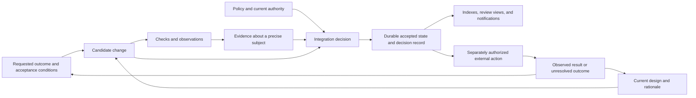

# 6. Synthesis and a research agenda

the-valley's aim is a useful end-to-end system assembled around clear requirements and deliberate
constraints. Existing solutions should satisfy individual requirements wherever they fit. The
central hypothesis is that consistent rules across those solutions can make the complete workflow
more capable and easier to operate. No individual subsystem needs to be an innovation.

The next step is a small reference workflow that makes those rules observable. Tests of portable
evidence, project understanding, and recovery should explain its behavior. Their purpose is to
locate the work needed to make the whole system succeed.

This chapter states the report's judgments. Its proposals are research recommendations, not adopted
project requirements. The empirical experiments below have not been run. Their purpose is to make
the most interesting claims falsifiable and to identify useful results even when a proposed approach
fails.

## 6.1 What the review supports

Five conclusions survive comparison with the literature and existing systems.

**Portable evidence is a sound organizing idea.** Build systems already provide a basis for reusing
computation under explicit dependency assumptions. Supply-chain systems already separate artifacts,
claims, signers, and policy. the-valley can combine those ideas into a record explaining why one
particular state was accepted. The opportunity is the precision and usefulness of that record,
rather than the mere existence of another signature format. The evidence and limits are in
[chapter 3](03-verification-and-integration.md).

**The knowledge graph has a stronger purpose than agent memory.** Its most interesting purpose is to
help a fresh contributor apply the project's design to an unfamiliar change. That is a measurable
claim about understanding. It can fail even when retrieval is excellent and every fact is recalled.
Conversely, a relatively small graph may succeed if it preserves the right explanations and
constraints. [Chapter 5](05-knowledge-agents-and-outcomes.md) develops this distinction from Naur,
design rationale, planning, and agent evaluation.

**Durable state plus reconciliation is a good starting point.** It gives the system a way to
discover unfinished work after a notification is lost. However, accepted decisions and external
effects need their own recovery semantics. The relevant contrast is between recoverable obligations
and transient messages. [Chapter 4](04-events-trust-and-durability.md) explains why current ref
replay is insufficient for complete historical recovery.

**Ordinary systems are strong candidates for adoption.** Concurrent merge validation, portable
execution, distributed collaboration records, and policy stored in a repository all have working
precedents. The first question is which configurations meet the requirements. Their guarantees and
operating costs determine where adaptation or custom work is justified. Those same configurations
also supply credible baselines for evaluating the complete workflow.
[Chapter 2](02-existing-systems.md) supplies those baselines.

**Autonomy needs separate boundaries for proposing, accepting, and acting.** An agent can propose
work without authority to integrate it. Integration can accept a source change without authorizing
every external effect. A system can automate evidence gathering while preserving human judgment over
what an outcome means. Treating these as distinct decisions creates more useful choices than one
global autonomy level.

## 6.2 Claims that should be narrowed before relying on them

The table identifies research findings about the snapshot. It does not silently amend the project's
design documents. Implementation concerns remain static findings until reproduced or ruled out by an
executable experiment.

| Claim or assumption in the local material                     | More defensible statement                                                                                                | Evidence and next check                                                                         |
| ------------------------------------------------------------- | ------------------------------------------------------------------------------------------------------------------------ | ----------------------------------------------------------------------------------------------- |
| A malicious local attester must reveal a modified tool hash   | A signer can claim an approved hash without executing that tool                                                          | Protocol counterexample in chapter 3; test a directly fabricated signed statement               |
| Pure re-verification leaves no residual attack                | Independent execution checks agreement under shared assumptions; an inadequate check can agree everywhere                | Chapter 3; use a passing no-op replacement and separate definition authorization from execution |
| Witness sampling guarantees detection within a bounded window | Random sampling provides a probability under stated assumptions; an isolated unsampled false claim may remain undetected | Chapter 3's sampling analysis; explicitly model witness capacity and correlated failures        |
| The described stack is roughly SLSA Build L3                  | No level follows without satisfying the specified builder and provenance requirements                                    | Chapter 3 and its SLSA source; map one real deployment requirement by requirement               |
| Replaying Git reconstructs the lived event history            | Current-ref enumeration reconstructs a view of surviving refs                                                            | Chapter 4; create, rewrite, and delete a ref before losing the bus                              |
| A landing and its evidence are one durable result             | The inspected sequence has multiple writes around the commit point                                                       | Chapter 4; interrupt the process between each durable write                                     |
| Every declared expiry is an enforced deadline                 | Raw compiled keys remain subject to successful policy convergence and recovery paths                                     | Chapter 4; let a key expire while compilation repeatedly fails                                  |
| A dependency DAG provides a critical-path scheduler           | Topology supplies precedence; useful criticality also needs duration and resource information                            | Chapter 5; compare priority-only and estimated-duration policies                                |
| Terminal blockers imply an outcome can be considered achieved | Administrative termination, readiness, and accepted attainment are different facts                                       | Chapter 5; abandon a required child while retaining the parent's acceptance condition           |
| Recording agent inputs explains exactly who did everything    | A trusted observer can record a run and its external actions; the record has collection and coverage limits              | Chapters 4 and 5; distinguish run occurrence, delegated principal, signer, and observed actions |

Several of these limits are already recognized in the knowledge graph or open questions. The report
does not claim to have discovered every issue first. Its contribution is to connect them to broader
literature and explain which claims would remain unjustified even after an obvious implementation
bug was fixed.

## 6.3 A useful boundary for the minimal core

The following is a proposed division of responsibility. It is not a protocol specification.

The key property is that each arrow names information the receiver needs. A check executor does not
decide the project's authority policy. An index does not become the only record of an approval. An
agent's proposed explanation does not become accepted knowledge merely because it is fluent. An
actuator does not infer unlimited authority from an integration event.

The minimal core could define identities, immutable records, policy evaluation inputs, and the
conditions under which a transition becomes accepted. Execution backends, scheduling heuristics,
retrieval systems, and user interfaces could remain replaceable. This is an architectural
preference, not evidence that the resulting implementation will be small. A second independent
consumer of the records is the practical test.

Existing contracts and components may supply these responsibilities. The proposed division does not
require a new core implementation.

The report also recommends separating the following graphs, even if they share storage:

| Graph                    | What an edge means                                                    | Mistake caused by treating it as another graph                          |
| ------------------------ | --------------------------------------------------------------------- | ----------------------------------------------------------------------- |
| Source history           | A commit names parent commits                                         | Assuming ancestry records every ref movement or operational event       |
| Computation dependencies | A result depends on an identified input or action                     | Treating common file paths as a complete dependency model               |
| Outcome dependencies     | A requested condition requires, or is supported by, another condition | Treating closed child tasks as proof of the parent                      |
| Provenance               | An activity used or produced an entity under stated attribution       | Treating a recorded relationship as a causal explanation of an incident |
| Authority delegation     | A principal grants bounded rights to another actor                    | Treating declared responsibility as enforced permission                 |

An undifferentiated graph with an edge named `depends_on` would be easier to implement initially and
harder to reason about later. The recommendation is semantic separation, not a demand for five
databases or an elaborate ontology.

## 6.4 The most promising solution spaces

### Evidence transfer as a conservative optimization

Start from a clearly authorized check over a clearly identified subject. Accept reuse only when the
system can establish that the relevant computation and inputs remain the same. Fall back to new
evidence when the dependency model is incomplete. This gives a soundness target independent of
whether the check itself is a good test.

There are several implementation choices: whole-tree identities, filtered source sets, declared
dependency closures, dynamic traces, or combinations. None is best in every project. Whole-tree
identities are conservative but can waste computation. Finer declarations can save work while adding
maintenance and omission risk. The research question is where the additional precision pays for
itself on the pilot's real workload.

Trust should be explicit alongside this optimization. A personal host, an isolated builder, and an
independent witness support different claims. A source change can be admitted under one policy while
a higher-impact deployment requires additional evidence. This preserves a useful fast path without
pretending that later revocation undoes every consequence.

### Immutable decisions with disposable views

Store a narrow decision record that identifies what was accepted, under which policy, and using
which evidence. Derive review pages, queues, indexes, and bus publications from retained facts. Keep
effect attempts and unresolved external outcomes durable where they cannot be reconstructed.

Possible storage choices include Git objects and refs, an append-only journal, or a transactional
store with exports. A single history should mean a coherent account of accepted project state and
its interpretation. It need not mean forcing every high-frequency telemetry event into the main
source branch.

The design should name its required atomic boundaries before selecting storage. If two records must
be accepted together, that is a constraint on the transaction or recovery protocol. If one is merely
a cache, it should be safely reconstructible. Describing both as files in the same repository does
not settle the distinction.

### Project knowledge as tested explanatory material

Preserve the current design in plain language, with enough premises and evidence to explain why it
takes its present form. Evaluate it using new changes and plausible design violations. Improve
retrieval only after establishing that the source material contains the necessary understanding.

This path permits multiple derived views: a short briefing for an agent, a design review for a
human, or a query over unresolved decisions. Each should point back to an accepted snapshot.
Generated summaries can be useful while remaining fallible views over the record.

The key risk is making the graph increasingly complete and increasingly expensive to maintain. Its
value should be measured net of that maintenance. If a concise design document performs as well as a
large typed graph, that is a useful result for a project committed to minimalism.

### Bounded production with explicit acceptance

Begin outcome automation with a ready-work query, a bounded attempt, and a separately evaluated
completion claim. Record why work is blocked, what evidence would clear the block, and when further
attempts should stop. Add scheduling intelligence as measured contention justifies it.

The important distinction is between a plan the system currently believes and an obligation the
project has accepted. Agents can revise plans as they learn. They should not silently weaken the
obligation to make the plan look successful. A revision to acceptance criteria is itself a decision
with authority and rationale.

This solution space remains useful even if the scheduler stays simple. A faithful record of
failures, assumptions, and incomplete evidence could improve human-directed work before autonomous
planning becomes dependable.

## 6.5 Experiments that would change the design

E9 is the overall test of the system. Start it with the smallest complete workflow supported by the
current scenario rung, and extend it as later rungs become relevant. E1–E8 investigate particular
risks and explain results from that workflow. Their numbering does not require eight successful
subsystem experiments before an end-to-end trial. Each experiment should preserve its inputs,
evaluator, failures, and raw measurements. Agree proposed thresholds before inspecting results.

### E1. Can a second implementation explain an accepted change?

Use an existing independent verifier where it supports the contract. Build a small read-only
verifier only for missing behavior, independently from the integrator's decision implementation.
Give it the accepted state, evidence records, relevant policy snapshots, and trust roots. Remove
access to the original controller and bus. Ask it to reproduce the reason for acceptance or report
the exact missing fact.

Evaluate historical authorization separately from present acceptability. Supply the historical
registry or checkpoint needed to establish what was authorized at decision time. A later revocation
may change what can be accepted now without erasing the reason the earlier decision was made.

Include ordinary changes, policy amendments, stale evidence, revoked keys, and a re-parented
landing. Test unknown predicate versions and unavailable artifacts. A verifier should distinguish an
invalid record from a record it lacks enough information to evaluate.

The key result is agreement on well-defined cases and explicit disagreement where the contract is
underspecified. If independent verification requires undocumented controller behavior, the protocol
boundary is incomplete. This experiment should precede claims of backend independence.

### E2. Is evidence reuse sound for the admitted computation model?

Create a corpus of changes with independently specified expected invalidations. Include source
edits, check-definition edits, compiler changes, generated inputs, directory additions, policy
changes, and changes to external observations. Include two independently authored edits that combine
badly despite a clean textual merge.

For deterministic checks, compare reuse decisions against execution of the approved check on the
candidate landing. Instrument the executor so that identical success markers from two different
commands do not count as identical computations. Repeat with whole-tree and finer dependency models.

Any reused result that disagrees with the specified deterministic computation is a failure of that
reuse rule. A zero-failure run is useful evidence for the tested cases, not proof for all programs.
Report conservatism as well: how much safe reuse was missed, and what declaration effort would
recover it? For effectful checks, specify acceptable observation age and scope instead of pretending
a rerun sees the identical world.

### E3. Where does the latency advantage come from?

Compare four configurations: a serialized check-and-merge loop; a speculative queue; the current
valley transfer approach; and a hybrid using speculation plus reuse. Run the same checks with the
same hardware budget and acceptance policy. Hold cache warmth constant within comparisons, then
repeat with cold caches.

Vary arrival rate, check duration, dependency overlap, failure rate, and the fraction of effectful
checks. Record time from completed authorship to acceptance, time spent waiting for required
evidence, serialized decision time, total compute, invalidations, and starvation. Report
distributions and worst waits, not only an average.

Use a common starting point before verification begins and include author-side execution. Also
report the narrower submission-to-acceptance interval. Moving computation before submission can
improve that interval without reducing total completion time; the measurements should reveal both
effects.

The result should identify operating regions. The transfer design is especially attractive if it
saves computation and waiting on real independent edits. If gains disappear once trust and caching
are equalized, speed alone does not justify the additional protocol. Policy evaluation and Nix
evaluation costs must appear in the measurement even if no test is intentionally run at commit time.

### E4. What survives interruption at each boundary?

Use a disposable repository and effect target. Interrupt the integrator between preparation, target
update, evidence publication, request deletion, and notification. Interrupt an actuator before and
after the remote system accepts an operation. Restart from retained state.

The test oracle should require an unambiguous accepted source state and a recoverable explanation.
For effects, it should require either one known logical result or an explicit unresolved result with
a recovery procedure. Merely exiting successfully on restart is insufficient.

Then remove the bus, delete a ref, lose a cache object, and restore an old registry snapshot. Record
which guarantees survive each loss. This creates a failure model based on demonstrations and reveals
which storage changes are necessary before later automation depends on the record.

### E5. Does the graph improve unfamiliar work?

Use the four knowledge conditions from chapter 5: ordinary docs; current graph; graph with
additional justifications; and a bounded derived briefing. Hold model, harness, tools, and budget
constant. Use tasks requiring changes the source material does not already solve.

Add a matched-information comparison: present the same facts and rationale as ordinary prose and as
typed nodes. This separates improvements in content from improvements in representation. Task
authors and evaluators should avoid wording held-out tasks around cues unique to the graph.

Blind a sample of human evaluations to the knowledge condition. Score conceptual errors, justified
abstention, working results, and later corrections. Include the cost of creating and maintaining
knowledge. Evaluate several independent runs per task and keep a held-out task set while improving
the graph.

This is the strongest test of the graph's distinctive purpose. If it improves recall but not
changes, investigate missing explanations and misleading authority cues. If ordinary docs perform
equally well, prefer the simpler representation for that class of work.

### E6. Can outcome automation avoid claiming false success?

Specify a small executable model before building a sophisticated scheduler. Include AND
requirements, OR alternatives, abandoned prerequisites, cancelled roots, expired evidence, and
recurring obligations. Give an agent permission to propose decompositions but a separate evaluator
authority to accept attainment.

Construct cases where every child is closed while the parent remains false. Include repeated
revisions that create new identifiers without making progress. Verify that cancellation withdraws
the cancelled root's demand from descendants and that late results from an expired attempt cannot
authorize an effect. Include a prerequisite shared by two live roots: cancelling one root must
preserve work and authority still justified by the other.

The failure criterion is an unsupported completion claim or an effect outside current authority.
Efficiency comes later. Compare against a manual ready-work query to establish what the automation
actually adds.

### E7. Does witness sampling buy the intended assurance?

Start with simulation using chapter 3's explicit probability model. Vary audit probability,
detection probability, witness backlog, error clustering, and compromised shared dependencies.
Separate random mistakes from a signer that waits until it has earned a favorable score before
making one false claim.

Then run controlled checks through independently configured witnesses. Measure detection delay and
the number and consequence of accepted actions before detection. Expiry of authority and
invalidation of historical evidence should be separate outputs.

The result should be an assurance statement for a workload and trust model, not a universal trust
score. If high-impact failures cannot tolerate the residual exposure, require stronger evidence
before those effects. A later successful revocation is not a successful prevention experiment.

### E8. Can the operator remain informed without reviewing everything?

Run a bounded trial across several weeks of representative work. Compare pre-integration review,
targeted review, sampled completed-change review, and scheduled digests. Group notifications by the
underlying decision rather than by each blocked agent.

Randomize comparable changes where appropriate or counterbalance trial periods to limit confounding
by workload changes and operator learning. A trial lasting several weeks can estimate routine
burden; it cannot by itself establish an assurance level for rare severe defects.

Measure interruptions, time spent reconstructing context, defects found, detection delay, and the
operator's ability to explain current system behavior. Sample uneventful changes as well as
failures; otherwise the trial cannot discover what unattended work silently changed.

The useful result is a policy that reduces review burden while preserving understanding and an
acceptable consequence profile. If nobody can explain the system after a quiet week of successful
automation, notification volume was the wrong success metric.

### E9. Does the complete workflow justify the composition?

Define a representative piece of work at the active scenario rung. For S2/S3, start with an intended
change and project context, give the work to a fresh author, establish the required evidence, and
integrate the result. Check both the resulting behavior and the retained explanation for acceptance.
As S4/S6 become relevant, extend the same workflow through an authorized effect, an observed
problem, recovery, and an update to project knowledge. A general scheduler is unnecessary for the
first trial.

Run this workflow on the valley configuration and the strongest practical existing configuration.
Match the intended result, trust assumptions, and resource budget. Where feasible, also compare the
same components with and without the proposed shared constraints. That comparison helps identify the
value of the integration decisions separately from the quality of the selected tools.

Measure successful outcomes, total elapsed time, operator intervention, reconstruction of missing
context, escaped defects, and recovery after interruption. Subsystem speed matters when it improves
these results. Count the work of maintaining adapters and reconciling records as part of the cost.

Then perform the same operating tasks: add a project, rotate a key, introduce a check, recover a
lost host, diagnose a failed integration, and change an executor. Count operator steps, required
credentials, separate upgrade procedures, and time spent locating authoritative state.

Record integration code and incident handling, not just component sizes. Repeat selected tasks after
a period without operating the system, because comprehensibility after absence is part of ownership.
If the composition is worse on routine work, identify whether the capabilities required by the
project compensate for that cost. A positive result may come entirely from configuration and clear
contracts between existing components. There should be a concrete reason to retain every custom
component.

## 6.6 Measurement discipline

The report recommends a prospective experiment register containing a question, hypothesis, baseline,
dataset or workload, fixed evaluator, primary measurements, and decision rule. Version the register
before collecting results. Exploratory observations can remain useful, but should be labeled as
exploratory rather than used to retroactively redefine success.

Separate the following quantities:

| Quantity                                   | Why it needs its own measurement                               |
| ------------------------------------------ | -------------------------------------------------------------- |
| Source accepted per unit time              | Measures the integrator; can rise while useful work stagnates  |
| Outcomes accepted under unchanged criteria | Measures delivered intent; still depends on evaluator adequacy |
| Time to recover project understanding      | Measures the knowledge record's practical value                |
| Human time and interruptions               | Captures supervision shifted out of the apparent fast path     |
| Compute and repeated attempts              | Prevents a retry-heavy system from appearing free              |
| Later rework and escaped defects           | Captures costs deferred beyond initial acceptance              |
| Lost or unresolved historical facts        | Measures whether the transparency promise survives failure     |

Use multiple projects when practical, including the-valley itself and a less tailored consumer.
Self-hosting is a valuable integration test but a biased effectiveness test: the project's own
conventions and authors are unusually adapted to the system. Negative results on another repository
may reveal a portability assumption that successful self-development conceals.

## 6.7 An opinionated end-to-end system

The project's success criterion is that a useful workflow meets clear requirements at an acceptable
cost. Individual tools can be familiar, and a suitable existing configuration can supply most of the
system. The work particular to the-valley may be selecting the constraints, connecting the tools,
and making the combined behavior dependable. That is sufficient reason to build it.

"More than the sum of its parts" should have an observable meaning. Each tool may work correctly in
isolation while the operator still has to reconstruct intent, translate identities, reconcile
policies, or discover lost obligations between them. A successful composition removes some of that
work without losing the guarantees it supplied. The important gain occurs at the handoffs.

### Constraints that could create the joint value

The following are proposed constraints on the complete system. They develop the requirements in
[chapter 1](01-project-and-problem-map.md#12-requirements-as-research-questions); they are not new
project decisions. They supplement the adopted premise constraints, which a component selection must
not implicitly waive. Each constrains the behavior of several components while leaving their
implementation open.

**A requested result keeps its meaning throughout the work.** A proposal, check, accepted change,
external action, and completion claim can identify the request they serve. The acceptance conditions
that applied remain available, together with any authorized amendments. An existing work tracker,
repository, executor, and evaluator can provide the parts. Their shared obligation is to prevent a
sequence of successful tasks from silently replacing the result that was requested.

**Verification has an identified definition and an explicit reuse rule.** Local and integration
checks agree on what is being tested. A consumer can decide whether supplied evidence applies to its
candidate state under the required trust policy. Uncertainty triggers new evidence or a recorded
block. Build systems, caches, and attestation tools can supply the mechanisms. Their shared contract
prevents a familiar check name or green status from acquiring different meanings at each boundary.

**Accepted changes and their reasons survive together.** After a supported failure, recovery retains
the facts needed to explain the accepted state. Indexes and notifications may be disposable when
those facts can reconstruct them. This constraint does not require one physical database or log. It
does require an explicit acknowledgment and recovery contract across the stores involved. The
tradeoff is that stronger durability may add coordination or delay.

**Authority is checked where the action occurs.** Permission to propose, integrate, deploy, and
amend an acceptance criterion remains distinguishable. Delayed or replayed work does not gain
authority merely by having been queued. An external action has a retained obligation and an observed
result, or an explicit unresolved outcome. Existing identity and workflow systems can enforce these
rules; the composition must align their scopes, revocation behavior, and recovery paths.

**Project understanding belongs to the project.** Accepted design explanations, important reasons,
open questions, and relevant outcomes remain readable and recoverable with the project. An agent
briefing or interface view identifies the source state it summarizes. Generated text becomes
authoritative only through the project's acceptance process. Documents, repositories, search, and
knowledge tools can supply the parts. The joint benefit is continuity when the author, interface, or
host changes, with an ongoing cost for keeping explanations useful.

**Replacement and recovery are ordinary operations.** A supported backup or export restores a usable
project, including the evidence and outstanding work needed to continue it. Replacing a component
preserves the agreed behavior at its boundaries. This requires maintained contracts and recovery
procedures; merely owning the bytes is insufficient. The benefit must be weighed against the work of
maintaining adapters and testing replacements.

These constraints deliberately restrict the available combinations. A tool may be excellent at its
local task and still require an expensive adapter to preserve project authority or durable reasons.
Another tool with fewer local features may make the complete workflow simpler. Choosing between them
requires a concrete fit assessment, not a preference for novelty, small executables, or a particular
shape of user interface.

### Adopt, configure, adapt, then build the missing part

For each responsibility, record the required behavior and its acceptance check. Identify which
existing components or configurations could supply it. Evaluate those candidates against the shared
constraints, including failure, recovery, and ongoing operator work. An existing solution that meets
the requirement is the default choice.

If configuration is insufficient, identify the smallest missing behavior. An adapter, upstream
change, or narrow custom component may supply it. The justification should name the requirement, the
candidate examined, the demonstrated gap, and the cost of closing it. A claim that a tool is
"platform-shaped" is not a sufficient rejection. A larger existing component may reduce the total
system's operating burden.

Adapters deserve the same scrutiny as other custom code. A short bridge that translates authority or
acceptance decisions can carry the system's most consequential rules. Its size does not make those
rules trivial. Conversely, a simple export transformation need not become a new universal protocol.

When a constraint excludes every practical solution, revisit its purpose. The choice may be to
accept the cost, narrow the supported workflow, or revise the constraint. Record that decision
explicitly. A constraint earns its place through the end-to-end property it protects.

### A complete journey is the decisive test

An agent receives an outcome and reconstructs the relevant design. It changes the project and
supplies the required evidence. The system accepts the change under explicit authority and performs
an authorized consequence. The primary host then fails. A replacement host restores the project and
resolves unfinished work. A fresh author can explain what happened and safely make the next change.

That journey combines familiar capabilities into a demanding whole. Evaluate it incrementally
through the scenario ladder, using E9 as the main test and E1–E8 to investigate its failure modes.
Compare with the strongest practical existing configuration under the same trust and resource
assumptions. A gain in completed work, recovery, understanding, or operator effort can justify the
composition. No component has to outperform every alternative in isolation.

The report therefore recommends clarifying the active requirements, choosing a small set of shared
constraints, and assembling the smallest complete workflow from established solutions. Build custom
mechanisms when a demonstrated gap calls for them. Expand scheduling and federation when a later
scenario requires them. Novelty may emerge from this work; it is not an acceptance criterion.
